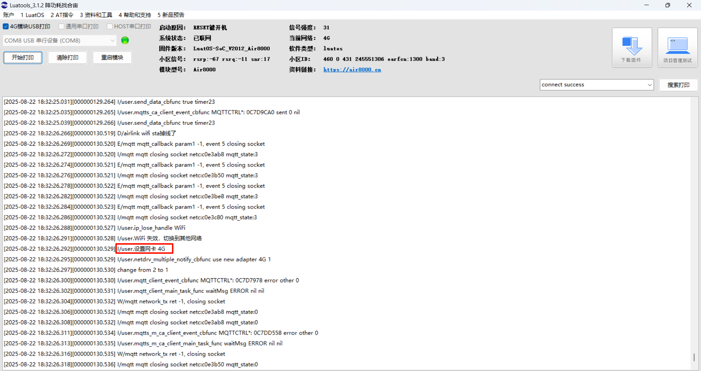
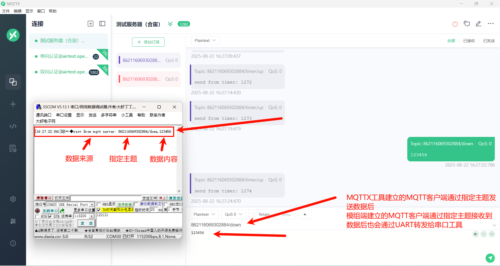
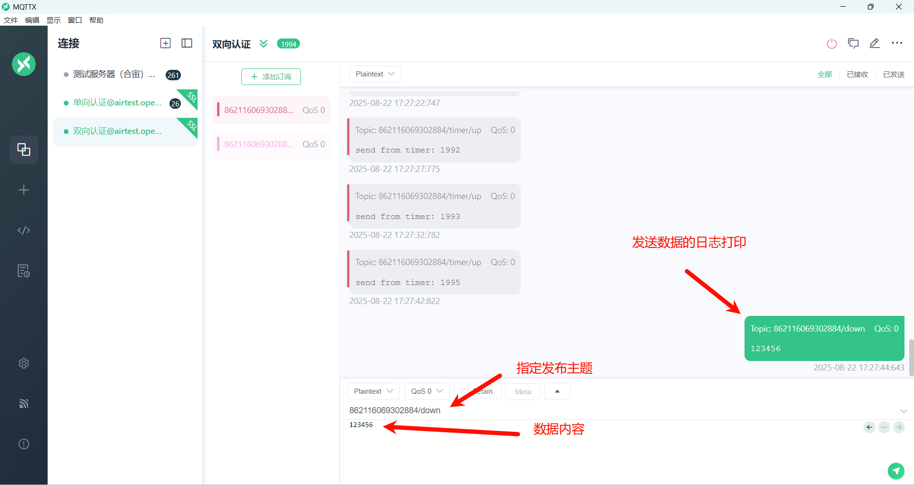

> 作者：马梦阳

## 一、MQTT 协议详解

### 1.1 什么是 MQTT？

MQTT（Message Queuing Telemetry Transport，消息队列遥测传输协议）是一种基于发布/订阅模式的轻量级通信协议。你可以把它想象成一个邮局系统：

- **发布者（Publisher）**：就像寄信的人，把消息发送到特定的“邮箱”（主题）。
- **订阅者（Subscriber）**：就像收信的人，他们事先告诉邮局（Broker）他们对哪些“邮箱”（主题）的信件感兴趣。
- **Broker（代理）**：就像邮局，负责接收发布者的消息，并根据订阅者的兴趣将消息分发给他们。

MQTT 协议由 IBM 在 1999 年开发，现在是 ISO 标准（ISO/IEC 20922），适用于物联网（IoT）和机器对机器（M2M）通信。

### 1.2 MQTT 的核心工作机制

**1\. 发布/订阅模式**：

- 发布者（Publisher）将消息发送到特定的主题（Topic）。
- 订阅者（Subscriber）向Broker订阅感兴趣的主题。
- Broker负责将发布到主题的消息路由给所有订阅了该主题的客户端。
- 这种模式实现了发布者和订阅者的解耦，简单来说就是它们不需要知道彼此的存在。

**2\. 服务质量（QoS）等级**：

- **QoS 0（最多一次）**：消息可能丢失，也可能因为网络层或中间件的意外重放而出现重复，但MQTT协议本身不会主动再发一次。适用于对可靠性要求不高的场景，如传感器数据。
- **QoS 1（至少一次）**：发送端会一直重试，直到收到接收端的PUBACK确认，因此消息至少送达一次，但也可能因确认丢失而被重复投递。适用于需要确保消息送达但可以容忍重复的场景。
- **QoS 2（只有一次）**：通过四步握手（PUBLISH → PUBREC → PUBREL → PUBCOMP）保证消息恰好送达一次；若任一步丢失，发送端会重传对应报文，直至整个流程完成，从而避免重复或丢失。适用于对消息可靠性要求极高的场景，如金融交易。

**3\. 轻量级设计**：

- MQTT协议头最小只有2字节，非常适合网络带宽和设备资源有限的环境。
- 协议简单，易于实现，降低了开发成本。

### 1.3 MQTT 的主要优势

- **低带宽消耗**：协议设计精简，有效减少网络流量。
- **低功耗**：适用于电池供电的设备。
- **高可靠性**：通过 QoS 机制保证消息传递的可靠性。
- **双向通信**：支持设备间和设备与服务器间的双向通信。
- **多语言支持**：支持多种编程语言，便于开发。
- **安全性强**：支持用户名/密码和 SSL/TLS 加密，保障通信安全。

### 1.4 典型应用场景

- **智能家居**：智能灯泡、智能插座、温控器等设备通过 MQTT 与家庭网关通信。
- **工业自动化**：传感器数据采集、设备状态监控。
- **环境监测**：气象站、水质监测站等远程数据收集。
- **车联网**：车辆状态信息上报、远程控制指令下发。
- **医疗监控**：远程病人监护设备数据传输。

## 二、演示功能概述

1\. 创建四路 mqtt 连接，详情如下

> 注意：代码中的 mqtt 服务器地址和端口会不定期重启或维护，仅能用作测试用途，不可商用，说不定哪一天就关闭了。用户开发项目时，需要替换为自己的商用服务器地址和端口。

- 创建一个 mqtt client，连接 mqtt server；
- 创建一个 mqtt ssl client，连接 mqtt ssl server，不做证书校验；
- 创建一个 mqtt ssl client，连接 mqtt ssl server，client 仅单向校验 server 的证书，server 不校验 client 的证书和密钥文件；
- 创建一个 mqtt ssl client，连接 mqtt ssl server，client 校验 server 的证书，server 校验 client 的证书和密钥文件；

2\. 每一路 mqtt 连接出现异常后，自动重连；

3\. 每一路 mqtt 连接，client 按照以下几种逻辑发送数据给 server

- 串口应用功能模块 `uart_app.lua`，通过 uart1 接收到串口数据，将串口数据增加 `send from uart: ` 前缀后，使用 `mobile.imei().."/uart/up"` 主题，发送给 server；
- 定时器应用功能模块 `timer_app.lua`，定时产生数据，将数据增加 `send from timer：` 前缀后，使用 `mobile.imei().."/timer/up"` 主题，发送给 server；

4\. 每一路 mqtt 连接，client 收到 server 数据后，将数据增加 recv from mqtt/mqtt ssl/mqtt ssl ca/mqtt ssl mutual ca（四选一）server: 前缀后，通过 uart1 发送出去；

5\. 启动一个网络业务逻辑看门狗 task，用来监控网络环境，如果连续长时间工作不正常，重启整个软件系统；

6\. netdrv_device：配置连接外网使用的网卡，目前支持以下四种选择（四选一）

(1) netdrv_4g：4G 网卡

(2) netdrv_wifi：WIFI STA 网卡

(3) netdrv_eth_spi：通过 SPI 外挂 CH390H 芯片的以太网卡

(4) netdrv_multiple：支持以上三种网卡，可以配置三种网卡的优先级

## 三、演示硬件环境


1\. Air8000 开发板一块 + 可上网的 sim 卡一张 +4g 天线一根 +wifi 天线一根 + 网线一根：

- sim 卡插入开发板的 sim 卡槽
- 天线装到开发板上
- 网线一端插入开发板网口，另外一端连接可以上外网的路由器网口

2\. TYPE-C USB 数据线一根 + USB 转串口数据线一根，Air8000 开发板和数据线的硬件接线方式为：

- Air8000 开发板通过 TYPE-C USB 口供电；（外部供电/USB 供电 拨动开关 拨到 USB 供电一端）
- TYPE-C USB 数据线直接插到核心板的 TYPE-C USB 座子，另外一端连接电脑 USB 口；
- USB 转串口数据线，一般来说，白线连接开发板的 UART1_TX，绿线连接开发板的 UART1_RX，黑线连接核心板的 GND，另外一端连接电脑 USB 口；

## 四、演示软件环境

### 4.1 软件环境

1\. 烧录工具：[Luatools 下载调试工具](https://docs.openluat.com/air780epm/common/Luatools/)

2\. 内核固件：[Air8000 V2012 版本固件](https://docs.openluat.com/air8000/luatos/firmware/)（理论上，2025 年 7 月 26 日之后发布的固件都可以）

3\. 脚本文件：[Air8000 MQTT 脚本文件](https://gitee.com/openLuat/LuatOS/tree/master/module/Air8000/demo/mqtt)

3\. PC 端串口工具：例如 [SSCOM](https://docs.openluat.com/air8000/luatos/common/swenv/#24-sscom)、[LLCOM](https://docs.openluat.com/air8000/luatos/common/swenv/#25-llcom) 等都可以

4\. MQTT 客户端：[MQTT 客户端软件 MQTTX](https://docs.openluat.com/air8000/luatos/common/swenv/#27-mqttmqttx)

5\. LuatOS 运行所需要的 lib 文件：使用 Luatools 烧录时，勾选 添加默认 lib 选项，使用默认 lib 脚本文件。

准备好软件环境之后，接下来查看[如何烧录项目文件到 Air8000 核心板](https://docs.openluat.com/air8000/luatos/common/download/)中，将本篇文章中演示使用的项目文件烧录到 Air8000 开发板中。

### 4.2 API 介绍

sys 库：[https://docs.openluat.com/osapi/core/sys/](https://docs.openluat.com/osapi/core/sys/)

libnet 库：[https://docs.openluat.com/osapi/ext/libnet/](https://docs.openluat.com/osapi/ext/libnet/)

socket 库：[https://docs.openluat.com/osapi/core/socket/](https://docs.openluat.com/osapi/core/socket/)

mqtt 库：[https://docs.openluat.com/osapi/core/mqtt/](https://docs.openluat.com/osapi/core/mqtt/)

## 五、程序结构

```lua
mqtt/
├── main.lua
├── mqtt/
│   ├── mqtt_main.lua
│   ├── mqtt_receiver.lua
│   └── mqtt_sender.lua
├── mqtts/
│   ├── mqtts_main.lua
│   ├── mqtts_receiver.lua
│   └── mqtts_sender.lua
├── mqtts_ca/
│   ├── mqtts_ca_main.lua
│   ├── mqtts_ca_receiver.lua
│   ├── mqtts_ca_sender.lua
│   ├── openluat_root_ca.crt
│   └── sntp_app.lua
├── mqtts_mutual_ca/
│   ├── airtest_client.crt
│   ├── airtest_client.key
│   ├── mqtts_m_ca_main.lua
│   ├── mqtts_m_ca_receiver.lua
│   ├── mqtts_m_ca_sender.lua
│   ├── openluat_root_ca.crt
│   └── sntp_app.lua
├── netdrv/
│   ├── netdrv_4g.lua
│   ├── netdrv_eth_spi.lua
│   ├── netdrv_multiple.lua
│   └── netdrv_wifi.lua
├── netdrv_device.lua
├── network_watchdog.lua
├── timer_app.lua
└── uart_app.lua
```

### 5.1 文件说明

- `main.lua`：主程序入口文件，负责初始化系统、启动网络驱动和 MQTT 客户端。
- `mqtt/`：普通 MQTT 连接相关文件。
  - `mqtt_main.lua`：普通 MQTT 客户端的初始化和事件处理。
  - `mqtt_receiver.lua`：普通 MQTT 客户端的数据接收处理。
  - `mqtt_sender.lua`：普通 MQTT 客户端的数据发送队列管理。
- `mqtts/`：MQTT SSL 连接（无证书校验）相关文件。
  - `mqtts_main.lua`：MQTT SSL 客户端的初始化和事件处理。
  - `mqtts_receiver.lua`：MQTT SSL 客户端的数据接收处理。
  - `mqtts_sender.lua`：MQTT SSL 客户端的数据发送队列管理。
- `mqtts_ca/`：MQTT SSL 连接（单向证书校验）相关文件。
  - `mqtts_ca_main.lua`：MQTT SSL 单向证书校验客户端的初始化和事件处理。
  - `mqtts_ca_receiver.lua`：MQTT SSL 单向证书校验客户端的数据接收处理。
  - `mqtts_ca_sender.lua`：MQTT SSL 单向证书校验客户端的数据发送队列管理。
  - `openluat_root_ca.crt`：服务器 CA 证书文件。
  - `sntp_app.lua`：时间同步应用。
- `mqtts_mutual_ca/`：MQTT SSL 连接（双向证书校验）相关文件。
  - `mqtts_m_ca_main.lua`：MQTT SSL 双向证书校验客户端的初始化和事件处理。
  - `mqtts_m_ca_receiver.lua`：MQTT SSL 双向证书校验客户端的数据接收处理。
  - `mqtts_m_ca_sender.lua`：MQTT SSL 双向证书校验客户端的数据发送队列管理。
  - `airtest_client.crt`：客户端证书文件。
  - `airtest_client.key`：客户端私钥文件。
  - `openluat_root_ca.crt`：服务器 CA 证书文件。
  - `sntp_app.lua`：时间同步应用。
- `netdrv/`：网络驱动相关文件。
  - `netdrv_4g.lua`：4G 网络驱动。
  - `netdrv_eth_spi.lua`：SPI 以太网驱动。
  - `netdrv_multiple.lua`：多网络驱动管理。
  - `netdrv_wifi.lua`：WIFI 网络驱动。
- `netdrv_device.lua`：网络设备配置文件。
- `network_watchdog.lua`：网络环境检测看门狗。
- `timer_app.lua`：定时器应用，用于生成测试数据。
- `uart_app.lua`：串口应用，用于与 PC 端通信。

## 六、核心模块详解

### 6.1 主程序 (`main.lua`)

主程序文件 `main.lua` 是整个项目的入口点。它负责初始化系统环境。

#### 6.1.1 初始化流程

**1\. 项目和版本定义**：

- 定义`PROJECT`和`VERSION`变量。

**2\. 日志记录**：

- 使用`log.info("main", PROJECT, VERSION)`在日志中打印项目名和版本号。

**3\. 看门狗初始化**（如果支持）：

- 配置并启动硬件看门狗，防止程序死循环卡死。

**4\. 加载功能模块**：

- 加载网络环境检测看门狗模块（`network_watchdog`）。
- 加载网络驱动设备模块（`netdrv_device`）。
- 加载串口应用模块（`uart_app`）。
- 加载定时器应用模块（`timer_app`）。
- 加载MQTT客户端主模块（`mqtt_main`）。
- 加载MQTT SSL客户端主模块（`mqtts_main`、`mqtts_ca_main`、`mqtts_m_ca_main`）。

**5\. 启动任务调度器**：

- 调用`sys.run()`启动LuatOS的任务调度器，开始执行各个任务。

```lua
--[[
@module  main
@summary LuatOS用户应用脚本文件入口，总体调度应用逻辑
@version 1.0
@date    2025.07.28
@author  马梦阳
@usage
本demo演示的核心功能为：
1、创建四路mqtt连接，详情如下
- 创建一个mqtt client，连接mqtt server；
- 创建一个mqtt ssl client，连接mqtt ssl server，不做证书校验；
- 创建一个mqtt ssl client，连接mqtt ssl server，client仅单向校验server的证书，server不校验client的证书和密钥文件；
- 创建一个mqtt ssl client，连接mqtt ssl server，client校验server的证书，server校验client的证书和密钥文件；
2、每一路mqtt连接出现异常后，自动重连；
3、每一路mqtt连接，client按照以下几种逻辑发送数据给server
- 串口应用功能模块uart_app.lua，通过uart1接收到串口数据，将串口数据增加send from uart: 前缀后，使用mobile.imei().."/uart/up"主题，发送给server；
- 定时器应用功能模块timer_app.lua，定时产生数据，将数据增加send from timer：前缀后，使用mobile.imei().."/timer/up"主题，发送给server；
4、每一路mqtt连接，client收到server数据后，将数据增加recv from mqtt/mqtt ssl/mqtt ssl ca/mqtt ssl mutual ca（四选一）server: 前缀后，通过uart1发送出去；
5、启动一个网络业务逻辑看门狗task，用来监控网络环境，如果连续长时间工作不正常，重启整个软件系统；
6、netdrv_device：配置连接外网使用的网卡，目前支持以下四种选择（四选一）
   (1) netdrv_4g：4G网卡
   (2) netdrv_wifi：WIFI STA网卡
   (3) netdrv_eth_spi：通过SPI外挂CH390H芯片的以太网卡
   (4) netdrv_multiple：支持以上三种网卡，可以配置三种网卡的优先级

更多说明参考本目录下的readme.md文件
]]

--[[
必须定义PROJECT和VERSION变量，Luatools工具会用到这两个变量，远程升级功能也会用到这两个变量
PROJECT：项目名，ascii string类型
        可以随便定义，只要不使用,就行
VERSION：项目版本号，ascii string类型
        如果使用合宙iot.openluat.com进行远程升级，必须按照"XXX.YYY.ZZZ"三段格式定义：
            X、Y、Z各表示1位数字，三个X表示的数字可以相同，也可以不同，同理三个Y和三个Z表示的数字也是可以相同，可以不同
            因为历史原因，YYY这三位数字必须存在，但是没有任何用处，可以一直写为000
        如果不使用合宙iot.openluat.com进行远程升级，根据自己项目的需求，自定义格式即可
]]
PROJECT = "MQTT"
VERSION = "001.000.000"

-- 在日志中打印项目名和项目版本号
log.info("main", PROJECT, VERSION)

-- 如果内核固件支持wdt看门狗功能，此处对看门狗进行初始化和定时喂狗处理
-- 如果脚本程序死循环卡死，就会无法及时喂狗，最终会自动重启
if wdt then
    --配置喂狗超时时间为9秒钟
    wdt.init(9000)
    --启动一个循环定时器，每隔3秒钟喂一次狗
    sys.timerLoopStart(wdt.feed, 3000)
end

-- 如果内核固件支持errDump功能，此处进行配置，【强烈建议打开此处的注释】
-- 因为此功能模块可以记录并且上传脚本在运行过程中出现的语法错误或者其他自定义的错误信息，可以初步分析一些设备运行异常的问题
-- 以下代码是最基本的用法，更复杂的用法可以详细阅读API说明文档
-- 启动errDump日志存储并且上传功能，600秒上传一次
-- if errDump then
--     errDump.config(true, 600)
-- end

-- 使用LuatOS开发的任何一个项目，都强烈建议使用远程升级FOTA功能
-- 可以使用合宙的iot.openluat.com平台进行远程升级
-- 也可以使用客户自己搭建的平台进行远程升级
-- 远程升级的详细用法，可以参考fota的demo进行使用

-- 启动一个循环定时器
-- 每隔3秒钟打印一次总内存，实时的已使用内存，历史最高的已使用内存情况
-- 方便分析内存使用是否有异常
-- sys.timerLoopStart(function()
--     log.info("mem.lua", rtos.meminfo())
--     log.info("mem.sys", rtos.meminfo("sys"))
-- end, 3000)

-- 加载网络环境检测看门狗功能模块
require "network_watchdog"

-- 加载网络驱动设备功能模块
require "netdrv_device"

-- 加载串口应用功能模块
require "uart_app"
-- 加载定时器应用功能模块
require "timer_app"

-- 加载mqtt client 主应用功能模块
require "mqtt_main"

-- 加载mqtt ssl client 主应用功能模块（mqtt ssl 无证书校验）
-- require "mqtts_main"

-- 加载mqtt ssl ca client 主应用功能模块（mqtt ssl 单向证书校验）
-- require "mqtts_ca_main"

-- 加载mqtt ssl mutual ca client 主应用功能模块（mqtt ssl 双向证书校验）
-- require "mqtts_m_ca_main"

-- 用户代码已结束---------------------------------------------
-- 结尾总是这一句
sys.run()
-- sys.run()之后不要加任何语句!!!!!因为添加的任何语句都不会被执行
```

### 6.2 网络驱动 (`netdrv/`)

网络驱动模块负责初始化和管理不同的网络连接方式，如 4G、WIFI 和以太网。

#### 6.2.1 4G 网络驱动 (`netdrv_4g.lua`)

- 监听 `IP_READY` 和 `IP_LOSE` 消息，监控网络连接状态。
- 设置默认网卡为 `socket.LWIP_GP`。

```lua
--[[
@module  netdrv_4g
@summary “4G网卡”驱动模块
@version 1.0
@date    2025.07.01
@author  马梦阳
@usage
本文件为4G网卡驱动模块，核心业务逻辑为：
1、监听"IP_READY"和"IP_LOSE"，在日志中进行打印；

本文件没有对外接口，直接在其他功能模块中require "netdrv_4g"就可以加载运行；
]]

local function ip_ready_func(ip, adapter)
    if adapter == socket.LWIP_GP then
        log.info("netdrv_4g.ip_ready_func", "IP_READY", socket.localIP(socket.LWIP_GP))
    end
end

local function ip_lose_func(adapter)
    if adapter == socket.LWIP_GP then
        log.warn("netdrv_4g.ip_lose_func", "IP_LOSE")
    end
end

-- 此处订阅"IP_READY"和"IP_LOSE"两种消息
-- 在消息的处理函数中，仅仅打印了一些信息，便于实时观察4G网络的连接状态
-- 也可以根据自己的项目需求，在消息处理函数中增加自己的业务逻辑控制，例如可以在连网状态发生改变时更新网络图标
sys.subscribe("IP_READY", ip_ready_func)
sys.subscribe("IP_LOSE", ip_lose_func)

-- 设置默认网卡为socket.LWIP_GP
-- 在Air8000上，内核固件运行起来之后，默认网卡就是socket.LWIP_GP
-- 在单4G网卡使用场景下，下面这一行代码加不加都没有影响，为了和其他网卡驱动模块的代码风格保持一致，所以加上了
socket.dft(socket.LWIP_GP)
```

#### 6.2.2 WIFI 网络驱动 (`netdrv_wifi.lua`)

- 初始化 WIFI 模块，连接指定的热点（需要修改成需要连接的 WiFi 热点名称和密码，并且是 2.4G，不支持 5G WiFi）。
- 通过将 `wlan.connect(, , 1)` 的第三个参数设置为 1 以开启自动重连功能。
- 设置默认网卡为 `socket.LWIP_STA`。

```lua
--[[
@module  netdrv_wifi
@summary “WIFI STA网卡”驱动模块
@version 1.0
@date    2025.07.01
@author  马梦阳
@usage
本文件为WIFI STA网卡驱动模块，核心业务逻辑为：
1、初始化WIFI网络；
2、连接WIFI路由器；
3、和WIFI路由器之间的连接状态发生变化时，在日志中进行打印；

本文件没有对外接口，直接在其他功能模块中require "netdrv_wifi"就可以加载运行；
]]

local function ip_ready_func(ip, adapter)
    if adapter == socket.LWIP_STA then
        log.info("netdrv_wifi.ip_ready_func", "IP_READY", json.encode(wlan.getInfo()))
    end
end

local function ip_lose_func(adapter)
    if adapter == socket.LWIP_STA then
        log.warn("netdrv_wifi.ip_lose_func", "IP_LOSE")
    end
end

-- 此处订阅"IP_READY"和"IP_LOSE"两种消息
-- 在消息的处理函数中，仅仅打印了一些信息，便于实时观察WIFI的连接状态
-- 也可以根据自己的项目需求，在消息处理函数中增加自己的业务逻辑控制，例如可以在连网状态发生改变时更新网络图标
sys.subscribe("IP_READY", ip_ready_func)
sys.subscribe("IP_LOSE", ip_lose_func)

-- 设置默认网卡为socket.LWIP_STA
socket.dft(socket.LWIP_STA)

wlan.init()
-- 连接WIFI热点，连接结果会通过"IP_READY"或者"IP_LOSE"消息通知
-- Air8000仅支持2.4G的WIFI，不支持5G的WIFI
-- 此处前两个参数表示WIFI热点名称以及密码，更换为自己测试时的真实参数即可
-- 第三个参数1表示WIFI连接异常时，内核固件会自动重连
wlan.connect("茶室-降功耗,找合宙!", "Air123456", 1)

-- WIFI联网成功（做为STATION成功连接AP，并且获取到了IP地址）后，内核固件会产生一个"IP_READY"消息
-- 各个功能模块可以订阅"IP_READY"消息实时处理WIFI联网成功的事件
-- 也可以在任何时刻调用socket.adapter(socket.LWIP_STA)来获取WIFI网络是否连接成功

-- WIFI断网后，内核固件会产生一个"IP_LOSE"消息
-- 各个功能模块可以订阅"IP_LOSE"消息实时处理WIFI断网的事件
-- 也可以在任何时刻调用socket.adapter(socket.LWIP_STA)来获取WIFI网络是否连接成功
```

#### 6.2.3 以太网网络驱动(`netdrv_eth_spi.lua`)

- 通过 SPI 接口外挂 CH390H 芯片实现以太网。
- 通过控制 GPIO140 引脚使能芯片供电。
- 配置 SPI1 接口参数，用于与 CH390H 芯片通信。
- 通过 `netdrv.setup` 函数配置以太网卡，并开启 DHCP 动态获取 IP 地址。
- 设置默认网卡为 `socket.LWIP_ETH`。

```lua
--[[
@module  netdrv_eth_spi
@summary “通过SPI外挂CH390H芯片的以太网卡”驱动模块
@version 1.0
@date    2025.07.24
@author  马梦阳
@usage
本文件为“通过SPI外挂CH390H芯片的以太网卡”驱动模块，核心业务逻辑为：
1、打开CH390H芯片供电开关；
2、初始化spi1，初始化以太网卡，并且在以太网卡上开启DHCP(动态主机配置协议)；
3、以太网卡的连接状态发生变化时，在日志中进行打印；

直接使用Air8000开发板硬件测试即可；

本文件没有对外接口，直接在其他功能模块中require "netdrv_eth_spi"就可以加载运行；
]]

local function ip_ready_func(ip, adapter)
    if adapter == socket.LWIP_ETH then
        log.info("netdrv_eth_spi.ip_ready_func", "IP_READY", socket.localIP(socket.LWIP_ETH))
    end
end

local function ip_lose_func(adapter)
    if adapter == socket.LWIP_ETH then
        log.warn("netdrv_eth_spi.ip_lose_func", "IP_LOSE")
    end
end

-- 此处订阅"IP_READY"和"IP_LOSE"两种消息
-- 在消息的处理函数中，仅仅打印了一些信息，便于实时观察“通过SPI外挂CH390H芯片的以太网卡”的连接状态
-- 也可以根据自己的项目需求，在消息处理函数中增加自己的业务逻辑控制，例如可以在连网状态发生改变时更新网络图标
sys.subscribe("IP_READY", ip_ready_func)
sys.subscribe("IP_LOSE", ip_lose_func)

-- 设置默认网卡为socket.LWIP_ETH
socket.dft(socket.LWIP_ETH)

-- 本demo测试使用的是Air8000开发板
-- GPIO140为CH390H以太网芯片的供电使能控制引脚
gpio.setup(140, 1, gpio.PULLUP)

-- 这个task的核心业务逻辑是：初始化SPI，初始化以太网卡，并在以太网卡上开启动态主机配置协议
local function netdrv_eth_spi_task_func()
    -- 初始化SPI1
    local result = spi.setup(
        1,--spi_id
        nil,
        0,--CPHA
        0,--CPOL
        8,--数据宽度
        25600000--,--频率
        -- spi.MSB,--高低位顺序    可选，默认高位在前
        -- spi.master,--主模式     可选，默认主
        -- spi.full--全双工       可选，默认全双工
    )
    log.info("netdrv_eth_spi", "spi open result", result)
    --返回值为0，表示打开成功
    if result ~= 0 then
        log.error("netdrv_eth_spi", "spi open error",result)
        return
    end

    --初始化以太网卡

    --以太网联网成功（成功连接路由器，并且获取到了IP地址）后，内核固件会产生一个"IP_READY"消息
    --各个功能模块可以订阅"IP_READY"消息实时处理以太网联网成功的事件
    --也可以在任何时刻调用socket.adapter(socket.LWIP_ETH)来获取以太网是否连接成功

    --以太网断网后，内核固件会产生一个"IP_LOSE"消息
    --各个功能模块可以订阅"IP_LOSE"消息实时处理以太网断网的事件
    --也可以在任何时刻调用socket.adapter(socket.LWIP_ETH)来获取以太网是否连接成功

    -- socket.LWIP_ETH 指定网络适配器编号
    -- netdrv.CH390外挂CH390
    -- SPI ID 1, 片选 GPIO12
    netdrv.setup(socket.LWIP_ETH, netdrv.CH390, {spi=1, cs=12})

    -- 在以太网上开启动态主机配置协议
    netdrv.dhcp(socket.LWIP_ETH, true)
end

-- 创建并且启动一个task
-- task的处理函数为netdrv_eth_spi_task_func
sys.taskInit(netdrv_eth_spi_task_func)
```

#### 6.2.4 多网络驱动管理 (`netdrv_multiple.lua`)

- 管理多个网络驱动实例，根据配置选择合适的网络连接方式。
- 通过 `exnetif.set_priority_order` 函数配置多网卡的控制参数以及优先级。
- 通过 `exnetif.notify_status` 函数设置网卡状态变化通知回调函数。

```lua
--[[
@module  netdrv_multiple
@summary 多网卡（4G网卡、WIFI STA网卡、通过SPI外挂CH390H芯片的以太网卡）驱动模块
@version 1.0
@date    2025.07.24
@author  马梦阳
@usage
本文件为多网卡驱动模块，核心业务逻辑为：
1、调用exnetif.set_priority_order配置多网卡的控制参数以及优先级；

直接使用Air8000开发板硬件测试即可；

本文件没有对外接口，直接在其他功能模块中require "netdrv_multiple"就可以加载运行；
]]

local exnetif = require "exnetif"

-- 网卡状态变化通知回调函数
-- 当exnetif中检测到网卡切换或者所有网卡都断网时，会触发调用此回调函数
-- 当网卡切换切换时：
--     net_type：string类型，表示当前使用的网卡字符串
--     adapter：number类型，表示当前使用的网卡id
-- 当所有网卡断网时：
--     net_type：为nil
--     adapter：number类型，为-1
local function netdrv_multiple_notify_cbfunc(net_type,adapter)
    if type(net_type)=="string" then
        log.info("netdrv_multiple_notify_cbfunc", "use new adapter", net_type, adapter)
    elseif type(net_type)=="nil" then
        log.warn("netdrv_multiple_notify_cbfunc", "no available adapter", net_type, adapter)
    else
        log.warn("netdrv_multiple_notify_cbfunc", "unknown status", net_type, adapter)
    end
end

local function netdrv_multiple_task_func()
    --设置网卡优先级
    exnetif.set_priority_order(
        {
            -- “通过SPI外挂CH390H芯片”的以太网卡，使用Air8000开发板验证
            {
                ETHERNET = {
                    -- 供电使能GPIO
                    pwrpin = 140,
                    -- 设置的多个“已经IP READY，但是还没有ping通”网卡，循环执行ping动作的间隔（单位毫秒，可选）
                    -- 如果没有传入此参数，exnetif会使用默认值10秒
                    ping_time = 3000,

                    -- 连通性检测ip(选填参数)；
                    -- 如果没有传入ip地址，exnetif中会默认使用httpdns能否成功获取baidu.com的ip作为是否连通的判断条件；
                    -- 如果传入，一定要传入可靠的并且可以ping通的ip地址；
                    -- ping_ip = "填入可靠的并且可以ping通的ip地址",

                    -- 网卡芯片型号(选填参数)，仅spi方式外挂以太网时需要填写。
                    tp = netdrv.CH390,
                    opts = {spi=1, cs=12}
                }
            },

            -- WIFI STA网卡
            {
                WIFI = {
                    -- 要连接的WIFI路由器名称
                    ssid = "茶室-降功耗,找合宙!",
                    -- 要连接的WIFI路由器密码
                    password = "Air123456",

                    -- 连通性检测ip(选填参数)；
                    -- 如果没有传入ip地址，exnetif中会默认使用httpdns能否成功获取baidu.com的ip作为是否连通的判断条件；
                    -- 如果传入，一定要传入可靠的并且可以ping通的ip地址；
                    -- ping_ip = "填入可靠的并且可以ping通的ip地址",
                }
            },

            -- 4G网卡
            {
                LWIP_GP = true
            }
        }
    )
end

-- 设置网卡状态变化通知回调函数netdrv_multiple_notify_cbfunc
exnetif.notify_status(netdrv_multiple_notify_cbfunc)

-- 如果存在udp网络应用，并且udp网络应用中，根据应用层的心跳能够判断出来udp数据通信出现了异常；
-- 可以在判断出现异常的位置，调用一次exnetif.check_network_status()接口，强制对当前正式使用的网卡进行一次连通性检测；
-- 如果存在tcp网络应用，不需要用户调用exnetif.check_network_status()接口去控制，exnetif会在tcp网络应用通信异常时自动对当前使用的网卡进行连通性检测。

-- 启动一个task，task的处理函数为netdrv_multiple_task_func
-- 在处理函数中调用exnetif.set_priority_order设置网卡优先级
-- 因为exnetif.set_priority_order要求必须在task中被调用，所以此处启动一个task
sys.taskInit(netdrv_multiple_task_func)
```

### 6.3 MQTT 客户端 (`mqtt/`, `mqtts/`, `mqtts_ca/`, `mqtts_mutual_ca/`)

每个 MQTT 客户端目录都包含三个核心文件：`_main.lua`、`_receiver.lua` 和 `_sender.lua`，分别负责客户端的初始化、数据接收和数据发送。

#### 6.3.1 客户端初始化 (`_main.lua`)

> 注意：代码中的 mqtt 服务器地址和端口会不定期重启或维护，仅能用作测试用途，不可商用，说不定哪一天就关闭了。用户开发项目时，需要替换为自己的商用服务器地址和端口。

- 创建 MQTT 客户端对象，配置服务器地址、端口、客户端 ID、用户名、密码等参数。
- 设置事件回调函数，处理连接、订阅、接收和异常等事件。
- 启动客户端任务，开始连接 MQTT 服务器。

#### 6.3.2 数据接收 (`_receiver.lua`)

- 实现 `proc` 函数，处理接收到的数据。
- 打印接收到的数据内容。
- 通过 `sys.publish("FEED_NETWORK_WATCHDOG")` 触发网络看门狗喂狗。

#### 6.3.3 数据发送 (`_sender.lua`)

- 实现 `send` 函数，将数据添加到发送队列。
- 管理发送队列，按顺序发送数据。
- 支持 QoS 配置和发送结果回调。

### 6.4 应用功能 (`timer_app.lua`, `uart_app.lua`)

应用功能模块负责生成测试数据和处理串口通信。

#### 6.4.1 定时器应用 (`timer_app.lua`)

- 创建一个 5 秒循环的定时器。
- 定时生成递增的测试数据。
- 通过 `sys.publish("SEND_DATA_REQ", data)` 发布发送请求消息。
- 实现发送结果回调，根据发送结果决定是否重发数据。

```lua
--[[
@module  timer_app
@summary 定时器应用功能模块
@version 1.0
@date    2025.07.01
@author  马梦阳
@usage
本文件为定时器应用功能模块，核心业务逻辑为：
创建一个5秒的循环定时器，每次产生一段数据，通知四个mqtt client进行处理；

本文件的对外接口有一个：
1、sys.publish("SEND_DATA_REQ", "timer", mobile.imei().."/timer/up", payload, 0, {func=send_data_cbfunc, para="timer"..payload})
   通过publish通知四路mqtt client数据发送功能模块publish数据;
   数据发送结果通过执行回调函数send_data_cbfunc通知本功能模块；
]]

local payload = 1

-- 数据发送结果回调函数
-- result：发送结果，true为发送成功，false为发送失败
-- para：回调参数，sys.publish("SEND_DATA_REQ", "timer", mobile.imei().."/timer/up", payload, 0, {func=send_data_cbfunc, para="timer"..payload})中携带的para
local function send_data_cbfunc(result, para)
    log.info("send_data_cbfunc", result, para)
    -- 无论上一次发送成功还是失败，启动一个5秒的定时器，5秒后发送下次数据
    sys.timerStart(send_data_req_timer_cbfunc, 5000)
end

-- 定时器回调函数
function send_data_req_timer_cbfunc()
    -- 发布消息"SEND_DATA_REQ"
    -- 携带的第一个参数"timer"表示是定时器应用模块发布的消息
    -- 携带的第二个参数mobile.imei().."/timer/up"为要publish的topic
    -- 携带的第三个参数payload为要publish的payload
    -- 携带的第四个参数0为publish的qos
    -- 携带的第五个参数cb为发送结果回调(可以为空，如果为空，表示不关心mqtt client发送数据成功还是失败)，其中：
    --       cb.func为回调函数(可以为空，如果为空，表示不关心mqtt client发送数据成功还是失败)
    --       cb.para为回调函数的第二个参数(可以为空)，回调函数的第一个参数为发送结果(true表示成功，false表示失败)
    sys.publish("SEND_DATA_REQ", "timer", mobile.imei().."/timer/up", payload, 0, {func=send_data_cbfunc, para="timer"..payload})
    payload = payload+1
end

-- 启动一个5秒的单次定时器
-- 时间到达后，执行一次send_data_req_timer_cbfunc函数
sys.timerStart(send_data_req_timer_cbfunc, 5000)
```

#### 6.4.2 串口应用 (`uart_app.lua`)

- 配置 UART1，波特率为 115200。
- 接收来自 PC 的数据，并通过 MQTT 发送。
- 将 MQTT 接收到的数据通过串口输出到 PC。
- 实现数据缓冲和超时处理。

```lua
--[[
@module  uart_app
@summary 串口应用功能模块
@version 1.0
@date    2025.07.28
@author  马梦阳
@usage
本文件为串口应用功能模块，核心业务逻辑为：
1、打开uart1，波特率115200，数据位8，停止位1，无奇偶校验位；
2、uart1和pc端的串口工具相连；
3、从uart1接收到pc端串口工具发送的数据后，通知四个mqtt client进行处理；
4、收到四个mqtt client从socket server接收到的数据后，将数据通过uart1发送到pc端串口工具；

本文件的对外接口有两个：
1、sys.publish("SEND_DATA_REQ", "uart", mobile.imei().."/uart/up", read_buf, 1)
   通知mqtt client数据发送模块，在mobile.imei().."/uart/up"的topic上publish数据read_buf，不关心数据发送成功还是失败；
2、sys.subscribe("RECV_DATA_FROM_SERVER", recv_data_from_server_proc)，订阅RECV_DATA_FROM_SERVER消息，处理消息携带的数据；
]]

-- 使用UART1
local UART_ID = 1
-- 串口接收数据缓冲区
local read_buf = ""

-- 将前缀prefix和topic，payload数据拼接
-- 然后末尾增加回车换行两个字符，通过uart发送出去，方便在PC端换行显示查看
local function recv_data_from_server_proc(prefix, topic, payload)
    uart.write(UART_ID, prefix..topic..","..payload.."\r\n")
end

local function concat_timeout_func()
    -- 如果存在尚未处理的串口缓冲区数据；
    -- 将数据通过publish通知其他应用功能模块处理；
    -- 然后清空本文件的串口缓冲区数据
    if read_buf:len() > 0 then
        sys.publish("SEND_DATA_REQ", "uart", mobile.imei().."/uart/up", read_buf, 1)
        read_buf = ""
    end
end

-- UART1的数据接收中断处理函数，UART1接收到数据时，会执行此函数
local function read()
    local s
    while true do
        -- 非阻塞读取UART1接收到的数据，最长读取1024字节
        s = uart.read(UART_ID, 1024)

        -- 如果从串口没有读到数据
        if not s or s:len() == 0 then
            -- 启动50毫秒的定时器，如果50毫秒内没收到新的数据，则处理当前收到的所有数据
            -- 这样处理是为了防止将一大包数据拆分成多个小包来处理
            -- 例如pc端串口工具下发1100字节的数据，可能会产生将近20次的中断进入到read函数，才能读取完整
            -- 此处的50毫秒可以根据自己项目的需求做适当修改，在满足整包拼接完整的前提下，时间越短，处理越及时
            sys.timerStart(concat_timeout_func, 50)
            -- 跳出循环，退出本函数
            break
        end

        log.info("uart_app.read len", s:len())
        -- log.info("uart_app.read", s)

        -- 将本次从串口读到的数据拼接到串口缓冲区read_buf中
        read_buf = read_buf..s
    end
end

-- 初始化UART1，波特率115200，数据位8，停止位1
uart.setup(UART_ID, 115200, 8, 1)

-- 注册UART1的数据接收中断处理函数，UART1接收到数据时，会执行read函数
uart.on(UART_ID, "receive", read)

-- 订阅"RECV_DATA_FROM_SERVER"消息的处理函数recv_data_from_server_proc
-- 收到"RECV_DATA_FROM_SERVER"消息后，会执行函数recv_data_from_server_proc
sys.subscribe("RECV_DATA_FROM_SERVER", recv_data_from_server_proc)
```

### 6.5 网络环境检测看门狗 (`network_watchdog.lua`)

网络看门狗模块负责监控网络连接状态和数据收发情况，确保系统在网络异常时能够自动恢复。

#### 6.5.1 设计原则

- 看门狗超时时间应大于任意一个 MQTT 连接的发送间隔。
- 通过接收 `FEED_NETWORK_WATCHDOG` 消息来喂狗。
- 超时未收到喂狗消息时，系统自动重启。

#### 6.5.2 实现细节

- 创建 `network_watchdog_task_func` 任务函数。
- 任务函数循环等待 `FEED_NETWORK_WATCHDOG` 消息，超时时间为 5 分钟。
- 超时则调用 `sys.restart("network timeout")` 重启系统。

```lua
--[[
@module  network_watchdog
@summary 网络环境检测看门狗功能模块
@version 1.0
@date    2025.07.23
@author  马梦阳
@usage
本文件为网络环境检测看门狗功能模块，监控网络环境是否工作正常（设备和服务器双向通信正常，或者至少单向通信正常），核心业务逻辑为：
1、启动一个网络环境检测看门狗task，等待其他mqtt网络应用功能模块来喂狗，如果喂狗超时，则控制软件重启；
2、如何确定“喂狗超时时间”，一般来说，有以下几个原则；
   (1) 先确定一个最小基准值T1，2分钟或者5分钟或者10分钟，这个取值取决于具体项目需求，但是不能太短，因为开机后，在网络环境不太好的地方，网络初始化可能需要比较长的时间，一般推荐这个值不能小于2分钟；
   (2) 再确定一个和产品业务逻辑有关的一个值T2，这个值和产品的应用业务逻辑息息相关，假设你的产品业务中：
       <1> 服务器会定时下发数据给设备，例如设备连接上业务服务器之后，每隔3分钟，设备都会给服务器发送一次心跳，然后服务器都会立即回复一个心跳应答包；
           这种情况下，可以取3分钟的大于等于1的倍数(例如1倍，1.5倍，2倍等等)+一段时间(例如10秒钟，如果前面是1倍，则此处必须加一段时间，给网络数据传输过程留够充足的时间)；
       <2> mqtt本身有keep alive的心跳机制，例如设备连接上业务服务器之后，默认每隔2分钟，设备都会给服务器发送一次心跳，服务器也会回复一个心跳应答数据；
           这种情况下，可以取2分钟的大于等于1的倍数(例如1倍，1.5倍，2倍等等)+一段时间(例如10秒钟，如果前面是1倍，则此处必须加一段时间，给网络数据传输过程留够充足的时间)；
    (3) 取T1和T2的最大值，就是“喂狗超时时间”
3、其他mqtt网络业务功能模块的喂狗时机，和上面2.2的描述相对应，一般来说，可以在以下几种时间点执行喂狗动作：
   (1) 设备收到服务器下发的数据时
   (2) 设备收到服务器回复的mqtt心跳应答数据时
4、最重要的一点是：以上所说的原则，仅仅是建议，要根据自己的实际项目业务逻辑以及自己的需求最终确定看门狗方案

5、具体到本demo
   (1) 产品业务逻辑为：
       <1> 创建了一个mqtt连接，设备每隔5秒钟发送一次数据到服务器，服务器何时下发应用数据给设备不确定；
       <2> 创建了一个mqtt ssl、不需要证书校验的连接，设备每隔5秒钟发送一次数据到服务器，服务器何时下发应用数据给设备不确定；
       <3> 创建了一个mqtt ssl、client单向校验server证书的连接，设备每隔5秒钟发送一次数据到服务器，服务器何时下发应用数据给设备不确定；
       <4> 每隔3分钟，这三路mqtt连接都会发送一次mqtt心跳给server，server收到心跳后回复心跳应答给client；
   (2) 确定喂狗超时时间：
       <1> 本demo支持单WIFI、单以太网、单4G网络连接外网，网络环境准备就绪预留2分钟的时间已经足够，所以最小基准值T1取值2分钟；
       <2> 本demo中存在3路mqtt连接，但是这3路mqtt连接都没有定时或者至少一段时间，服务器下发应用数据给设备，所以无法基于服务器下发应用数据的业务逻辑来确定T2的值；
       <3> 本demo中存在3路mqtt连接，每1路mqtt连接，设备都是3分钟发送一次mqtt心跳数据给服务器，服务器收到后会立即回复一个mqtt心跳应答数据给设备；
           所以可以通过3分钟的大于等于1的倍数(例如1倍，1.5倍，2倍等等)+一段时间(例如10秒钟，如果前面是1倍，则此处必须加一段时间，给网络数据传输过程留够充足的时间)来确定T2的值；
           在这个demo中，我能接受的网络连续异常时长是5分钟，所以，T2取值5分钟；
       <4> 取T1 2分钟和T2 5分钟的最大值，最终的喂狗超时时间就是5分钟；
   (3) 确定喂狗时机：
       <1> 3路mqtt连接中，任何1路收到服务器的下发的应用数据时；
       <2> 3路mqtt连接中，任何1路收到服务器的回复的心跳应答数据时；
6、本demo设计的网络环境检测看门狗功能模块，可以检测以下两种种的任意一种网络环境异常：
   (1) 网络环境连续超过5分钟没有准备就绪
   (2) mqtt、mqtt ssl、mqtt ssl单向校验证书3路连接中，连续5分钟没有收到服务器下发的应用数据或者服务器回复的心跳应答数据； 

本文件没有对外接口，直接在main.lua中require "network_watchdog"就可以加载运行；
外部功能模块喂狗时，直接调用sys.publish("FEED_NETWORK_WATCHDOG")
]]

-- 网络环境检测看门狗task处理函数
local function network_watchdog_task_func()
    while true do
        --如果等待180秒没有等到"FEED_NETWORK_WATCHDOG"消息，则看门狗超时
        if not sys.waitUntil("FEED_NETWORK_WATCHDOG", 300000) then
            log.error("network_watchdog_task_func timeout")
            -- 等待3秒钟，然后软件重启
            sys.wait(3000)
            rtos.reboot()
        end
    end
end

--创建并且启动一个task
--运行这个task的处理函数network_watchdog_task_func
sys.taskInit(network_watchdog_task_func)
```

### 6.6 SSL 连接实现

项目展示了三种不同的 SSL 连接实现方式，满足不同安全等级的需求。

#### 6.6.1 无证书校验 (`mqtts/`)

- 在创建 MQTT 客户端时，设置 `ssl` 参数为 `true`。
- 不进行服务器证书校验，适用于对安全性要求不高的场景。

#### 6.6.2 单向证书校验 (`mqtts_ca/`)

- 加载服务器 CA 证书文件 `openluat_root_ca.crt`。
- 在创建 MQTT 客户端时，配置 `ssl` 参数，指定 CA 证书路径。
- 依赖 `sntp_app.lua` 同步系统时间，以验证证书有效期。

#### 6.6.3 双向证书校验 (`mqtts_mutual_ca/`)

- 同时加载服务器 CA 证书、客户端证书和客户端私钥。
- 在创建 MQTT 客户端时，配置 `ssl` 参数，指定所有证书和密钥的路径。
- 使用特定端口（8886）进行连接。

## 七、系统与用户消息类型

### 7.1 系统消息

- `IP_READY`：网络 IP 地址已准备好。
- `IP_LOSE`：网络 IP 地址丢失。
- `NTP_UPDATE`：SNTP 时间同步完成。

### 7.2 用户消息

- `RECV_DATA_FROM_SERVER`：从 MQTT 服务器接收到数据。
- `SEND_DATA_REQ`：请求发送数据。
- `FEED_NETWORK_WATCHDOG`：网络看门狗喂狗消息。

## 八、演示功能

### 8.1 准备工作

#### 8.1.1 MQTT 客户端建立

MQTT 客户端测试工具：[MQTT 客户端软件 MQTTX](https://docs.openluat.com/air8000/luatos/common/swenv/#27-mqttmqttx)

（1）创建一个 MQTT 客户端

> 这里我使用合宙测试服务器（lbsmqtt.airm2m.com:1884）进行建立，大家一定不要将测试服务器用于正式批量的项目中。


（2）设置发布/订阅主题

> 在设置发布/订阅主题时，主题格式一定要根据要求来写，否则会出现数据无法通信的情况。


#### 8.1.2 MQTT SSL 客户端建立（无证书校验、单向认证）

MQTT 客户端测试工具：[MQTT 客户端软件 MQTTX](https://docs.openluat.com/air8000/luatos/common/swenv/#27-mqttmqttx)

（1）创建一个 MQTT 客户端

> 这里我使用合宙测试服务器（airtest.openluat.com:8888）进行建立，大家一定不要将测试服务器用于正式批量的项目中。
> 无证书校验、单向认证使用的是同一个域名端口，在 MQTTX 工具上创建客户端只是用于与 Air8000 建立的 MQTT 客户端进行数据通信，因此这时候可以在 MQTTX 工具上只建立一个 MQTT SSL 客户端。


（2）设置发布/订阅主题

> 在设置发布/订阅主题时，主题格式一定要根据要求来写，否则会出现数据无法通信的情况。


#### 8.1.3 MQTT SSL 客户端建立（双向认证）

MQTT 客户端测试工具：[MQTT 客户端软件 MQTTX](https://docs.openluat.com/air8000/luatos/common/swenv/#27-mqttmqttx)

（1）创建一个 MQTT 客户端

> 这里我使用合宙测试服务器（airtest.openluat.com:8886）进行建立，大家一定不要将测试服务器用于正式批量的项目中。


（2）设置发布/订阅主题

> 在设置发布/订阅主题时，主题格式一定要根据要求来写，否则会出现数据无法通信的情况。


### 8.2 不同网卡切换

> Air8000 模组支持单 4g 网卡，单 wifi 网卡，单 spi 以太网卡，多网卡。

#### 切换网卡为 4G 网卡：

在 `netdrv_device.lua` 模块里只打开 `netdrv_4g` 模块。`netdrv_4g.lua` 模块中的代码不需要修改。


LuaTools 工具日志打印：

如下图所示，如出现类似 `I/user.netdrv_4g.ip_ready_func IP_READY 10.246.107.37 255.255.255.255 0.0.0.0 nil` 的日志，则表示 4g 网卡连接成功。


#### 切换网卡为 WiFi 网卡：

> 注意：如果需要单 WIFI STA 网卡，打开 `require "netdrv_wifi"`，其余注释掉；同时 `netdrv_wifi.lua` 中的 `wlan.connect("茶室-降功耗,找合宙!", "Air123456", 1)`，前两个参数，修改为自己测试时 wifi 热点的名称和密码；注意：仅支持 2.4G 的 wifi，不支持 5G 的 wifi

在 `netdrv_device.lua` 模块里只打开 `netdrv_wifi` 模块。`netdrv_wifi` 模块中的代码不需要修改。


luatools 日志打印：

如出现类似 `I/user.netdrv_wifi.ip_ready_func IP_READY {"gw":"192.168.168.199","rssi":-31,"bssid":"722D10C7C9CF"}` 的日志，则表示 WIFI STA 网卡联网成功。


#### 切换网卡为以太网卡：

> 注意：Air8000 的以太网卡是通过 SPI 外挂 CH390H 芯片实现的。

在 `netdrv_device.lua` 模块里只打开 `netdrv_eth_spi` 模块。如果是使用合宙官方的开发板，`netdrv_eth_spi` 模块中的代码不需要修改。


luatools 日志打印：

如出现类似 `I/user.netdrv_eth_spi.ip_ready_func IP_READY 192.168.0.110 255.255.255.0 192.168.0.1 nil` 的日志，则表示以太网卡联网成功。


#### 多网卡自动切换：

> 如果需要多网卡，打开 `require "netdrv_multiple"`，其余注释掉；同时 `netdrv_multiple.lua` 中的 `ssid = "茶室-降功耗,找合宙!", password = "Air123456"`, 修改为自己测试时 wifi 热点的名称和密码；注意：仅支持 2.4G 的 wifi，不支持 5G 的 wifi。
> 可根据自己的需求调整网卡的优先级，以下示例设置为以太网卡是最高优先级。

首先在 `netdrv_device.lua` 文件中只打开 `netdrv_multiple` 模块。


默认以太网卡进行连接


拔掉网线后，网络切换为 wifi 网卡


关闭设备连接的 wifi 热点，切换为 4g 网卡



### 8.3 MQTT 通信实操

#### MQTT 客户端数据发送与接收：

下图为 Air8000 模组建立的 MQTT 客户端通过指定主题向其他同域名端口的 MQTT 客户端发送数据成功后的日志打印。


如下图在 MQTTX 测试工具上建立相同域名端口的 MQTT 客户端（Client ID 需要不一致），通过订阅指定主题，可以接收到其他同域名端口的 MQTT 客户通过该指定主题发送的数据。


如下图所示，通过 MQTTX 测试工具上建立的 MQTT 客户端向指定主题发送一个数据。


模组端在建立同域名端口的 MQTT 客户端后，在代码中还订阅了指定主题，因此 MQTTX 测试工具上建立的同域名端口的 MQTT 客户端通过指定主题发送数据时，模组端建立的同域名端口的 MQTT 客户端可以接收到这个数据，并在代码中做了处理，从而让其显示在 LuaTools 工具上。


在 PC 端使用串口工具发送数据给 Air8000，Air8000 内部会将接收到的数据通过建立的同域名端口的 MQTT 客户端按照指定主题转发出去，MQTTX 测试工具建立的同域名端口的 MQTT 客户端通过订阅这个指定主题可以接收到 Air8000 转发出去的数据。


在 MQTTX 测试工具建立的同域名端口的 MQTT 客户端，通过指定主题发送数据后，Air8000 模组建立的同域名端口的 MQTT 客户端通过订阅该指定主题后可以接收到数据，并将数据通过 UART 转发给 PC 端串口工具。



#### MQTT SSL 客户端（无证书校验）数据发送与接收：

下图为 Air8000 模组建立的 MQTT SSL 客户端（无证书校验）通过指定主题向其他同域名端口的 MQTT SSL 客户端发送数据成功后的日志打印。


如下图在 MQTTX 测试工具上建立相域名端口的 MQTT SSL 客户端（Client ID 需要不一致），通过订阅指定主题，可以接收到其他同域名端口的 MQTT SSL 客户通过该指定主题发送的数据。


如下图所示，通过 MQTTX 测试工具建立的同域名端口的 MQTT SSL 客户端向指定主题发送一个数据。


模组端在建立同域名端口 MQTT SSL 客户端（无证书校验）后，在代码中订阅了这个指定主题，因此当 MQTTX 测试工具建立的同域名端口的 MQTT SSL 客户端通过指定主题发送数据时，模组端建立的同域名端口的 MQTT SSL 客户端（无证书校验）可以接收到这个数据，并在代码中做了处理，从而让其显示在 LuaTools 工具上。


在 PC 端使用串口工具发送数据给 Air8000，Air8000 内部会将接收到的数据通过建立的同域名端口 MQTT SSL 客户端（无证书校验）按照指定主题转发出去，MQTTX 测试工具建立的同域名端口的 MQTT SSL 客户端通过订阅这个指定主题可以接收到 Air8000 转发出去的数据。


在 MQTTX 测试工具建立的同域名端口的 MQTT SSL 客户端（无证书校验）通过指定主题发送数据后，Air8000 模组建立的同域名端口的 MQTT SSL 客户端（无证书校验）通过订阅该指定主题后可以接收到数据，并将数据通过 UART 转发给 PC 端串口工具。


#### MQTT SSL 客户端（单向认证）数据发送与接收

下图为 Air8000 模组建立的 MQTT SSL 客户端（单向认证）通过指定主题向其他同域名端口的 MQTT 客户端发送数据成功后的日志打印。


如下图在 MQTTX 测试工具上建立同域名端口的 MQTT SSL 客户端（Client ID 需要不一致），通过订阅指定主题，可以接收到其他同域名端口的 MQTT SSL 客户通过该主题发送的数据。


如下图所示，通过 MQTTX 测试工具建立的同域名端口的 MQTT SSL 客户端（单向认证）向指定主题发送一个数据。


模组端在建立同域名端口 MQTT SSL 客户端（单向认证）后，在代码中还订阅了指定主题，因此当 MQTTX 测试工具建立的同域名端口的 MQTT SSL 客户端通过指定主题发送数据时，模组端建立的同域名端口的 MQTT SSL 客户端（单向认证）可以接收到这个数据，并在代码中做了处理，从而让其显示在 LuaTools 工具上。


在 PC 端使用串口工具发送数据给 Air8000，Air8000 内部会将接收到的数据通过建立的同域名端口的 MQTT SSL 客户端（单向认证）按照指定主题转发出去，MQTTX 测试工具建立的同域名端口的 MQTT SSL 客户端通过订阅这个指定主题可以接收到 Air8000 转发出去的数据。


在 MQTTX 测试工具建立的同域名端口的 MQTT SSL 客户端（单向认证）通过指定主题发送数据后，Air8000 模组建立的同域名端口的 MQTT SSL 客户端（单向认证）通过订阅该指定主题后可以接收到数据，并将数据通过 UART 转发给 PC 端串口工具。


#### MQTT SSL 客户端（双向认证）数据发送与接收

下图为 Air8000 模组建立的 MQTT SSL 客户端（双向认证）通过指定主题向其他同域名端口的 MQTT SSL 客户端发送数据成功后的日志打印。


如下图在 MQTTX 测试工具上建立同域名端口的 MQTT 客户端（Client ID 需要不一致），通过订阅指定主题，可以接收到其他同域名端口的 MQTT 客户端通过该主题发送的数据。


如下图所示，通过 MQTTX 测试工具建立的同域名端口的 MQTT SSL 客户端向指定主题发送一个数据。



模组端在建立同域名端口 MQTT SSL 客户端（双向认证）后，在代码中还订阅了指定主题，因此当 MQTTX 测试工具建立的同域名端口的 MQTT SSL 客户端通过指定主题发送数据时，模组端建立的同域名端口的 MQTT SSL 客户端（双向认证）可以接收到这个数据，并在代码中做了处理，从而让其显示在 LuaTools 工具上。


在 PC 端使用串口工具发送数据给 Air8000，Air8000 内部会将接收到的数据通过建立的 MQTT SSL 客户端（双向认证）按照指定主题转发出去，MQTTX 测试工具建立的同域名端口的 MQTT SSL 客户端通过订阅这个指定主题可以接收到 Air8000 转发出去的数据。


在 MQTTX 测试工具建立的同域名端口的 MQTT SSL 客户端（双向认证）通过指定主题发送数据后，Air8000 模组建立的同域名端口的 MQTT SSL 客户端（双向认证）通过订阅该指定主题后可以接收到数据，并将数据通过 UART 转发给 PC 端串口工具。


## 六、总结

至此，我们演示了使用不同网卡进行 MQTT 通信的全过程，相信聪明的你已经完全领悟 MQTT 通信的逻辑了，快来实际操作一下吧！
